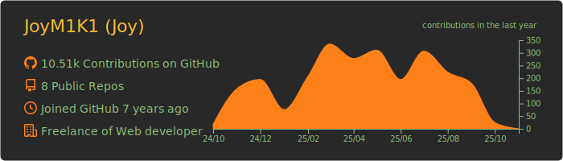

<!--
**JoyM1K1/JoyM1K1** is a ✨ _special_ ✨ repository because its `README.md` (this file) appears on your GitHub profile.

Here are some ideas to get you started:

- 🔭 I’m currently working on ...
- 🌱 I’m currently learning ...
- 👯 I’m looking to collaborate on ...
- 🤔 I’m looking for help with ...
- 💬 Ask me about ...
- 📫 How to reach me: ...
- 😄 Pronouns: ...
- ⚡ Fun fact: ...
-->

<!--  -->

# 自己紹介

**Joy** と申します。 
CoeFontでエンジニアをしている傍ら、個人事業主としてweb開発やMobile Application開発などをしています。 
主に以下の領域でバリューを提供できます。

- Web
  - FE 設計・開発・テスト・運用
  - BE 設計・開発・テスト・運用
- Application
  - デスクトップアプリ（クロスプラットフォーム） 設計・開発・テスト・運用
- インフラ
  - Firebaseを用いたauthentication
  - NoSQL・RDBを用いたDB設計・保守・運用
- 上記を総括したシステム設計

最近は **TypeScript** や **Rust** などをメインに書いています。 
お仕事のご依頼は <a href="mailto:joytech.engineer@gmail.com">joytech.engineer@gmail.com</a> まで

# 学歴・職歴・得意な技術

### 学歴

| 年 | 月 | 学歴 |
| :-: | :-: | :-: |
| 2015 | 4 | `筑波大学/理工学群/物理学類` 入学 |
| 2019 | 3 | `筑波大学/理工学群/物理学類(学士: 理学)` 卒業 |
| 2019 | 4 | `筑波大学大学院/数理物質科学研究科/物理学専攻/素粒子理論研究室` 入学 |
| 2021 | 3 | `筑波大学大学院/数理物質科学研究科/物理学専攻(修士: 理学)` 修了 |

### 職歴
| 年 | 月 | 職歴 |
| :-: | :-: | :-: |
| 2019 | 8 | 学生エンジニアのアルバイトとして活動開始 |
| 2021 | 4 | **JoyTech** として個人事業開業 |
| 2021 | 4 | `バリューコマース株式会社`に新卒入社 |
| 2023 | 7 | `バリューコマース株式会社`を退社 |
| 2023 | 8 | `株式会社CoeFont`に入社 |
|      |   | フリーランスとしての副業も継続しつつ、現在に至る。 |

### 技術スタック

<!-- アイコンはこちらから -->
<!-- https://github.com/vscode-icons/vscode-icons/tree/master/icons -->

#### 言語

  
  
  
  
  

#### フレームワーク

  
  
  
  
  
  
  
  

#### インフラ・その他

  
  
  
  

### 詳細 👇

- [**業務経歴書**](resume.md)

# Stats

  
  

# このページに使用している技術

- [Badge Generator](https://badgen.org/)
- [Shields.io](https://shields.io/)
- [GitHubProfile のページを可能な限りキラキラさせる方法](https://zenn.dev/yutakatay/articles/kirakira-github-profile)
